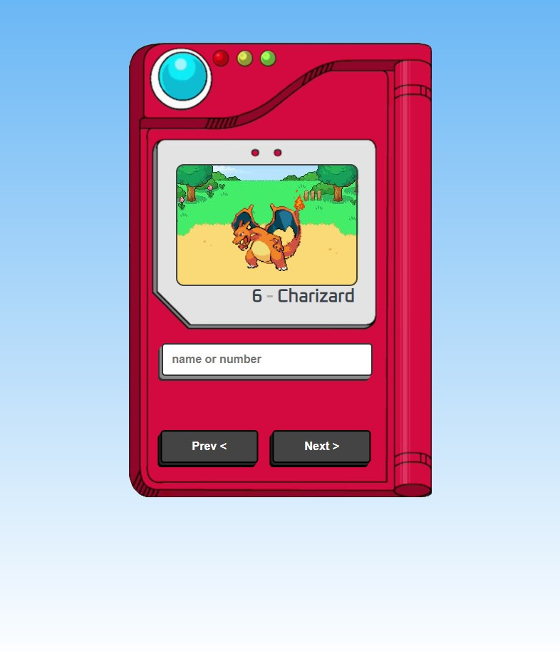

# Pokédex

Bem-vindo à Pokédex, um projeto de estudo desenvolvido utilizando HTML, CSS e JavaScript. Este projeto utiliza a PokéAPI para exibir informações detalhadas sobre os Pokémon.

## Descrição do Projeto

A Pokédex é uma enciclopédia virtual que contém informações sobre as diferentes espécies de Pokémon. Este projeto permite aos usuários pesquisar e visualizar dados como nome, tipo, habilidades, estatísticas e imagens dos Pokémon.

## Funcionalidades

- Pesquisa de Pokémon por nome ou número.
- Exibição detalhada das informações de cada Pokémon.
- Utilização da PokéAPI para obter dados em tempo real.
- Design responsivo para uma experiência de usuário consistente em dispositivos móveis e desktops.

## Tecnologias Utilizadas

- HTML5: Estruturação do conteúdo da página.
- CSS3: Estilização e layout responsivo.
- JavaScript: Manipulação do DOM e interações com a PokéAPI.

## API Utilizada

A PokéAPI é uma API gratuita e de código aberto que fornece informações completas sobre os Pokémon. Neste projeto, utilizamos a PokéAPI para obter dados como nome, tipo, habilidades e imagens dos Pokémon.

Para mais informações sobre a PokéAPI, visite: [PokéAPI](https://pokeapi.co/)

## Como Utilizar

1. Clone o repositório para o seu ambiente local:
    ```
    git clone https://github.com/seu-usuario/pokedex.git
    ```

2. Abra o arquivo `index.html` em seu navegador web favorito.

3. Pesquise um Pokémon pelo nome ou número na barra de pesquisa.

4. Explore as informações detalhadas do Pokémon, incluindo nome, tipo, habilidades, estatísticas e imagem.

5. Divirta-se explorando a Pokédex!

## Captura de Tela



## Contribuições

Se você deseja contribuir para este projeto, siga estas etapas:

1. Faça um fork do repositório.
2. Crie sua própria branch: `git checkout -b feature/sua-feature`.
3. Faça suas alterações e commit: `git commit -am 'Adicione sua feature'`.
4. Faça push para a branch: `git push origin feature/sua-feature`.
5. Envie um pull request.

## Licença

Este projeto está licenciado sob a [Licença MIT](LICENSE).

---

**Nota:** Este projeto é apenas para fins educacionais e de demonstração.
